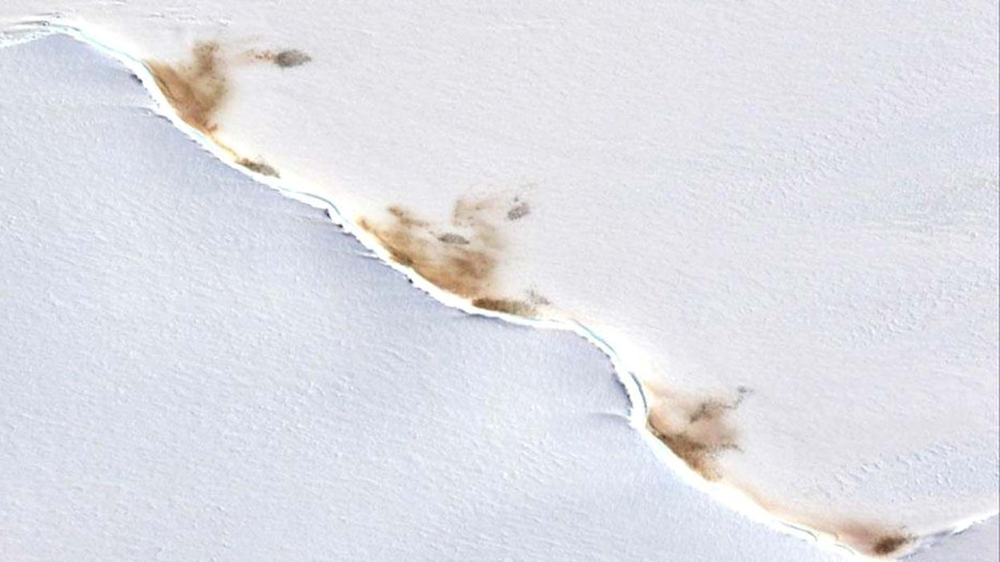
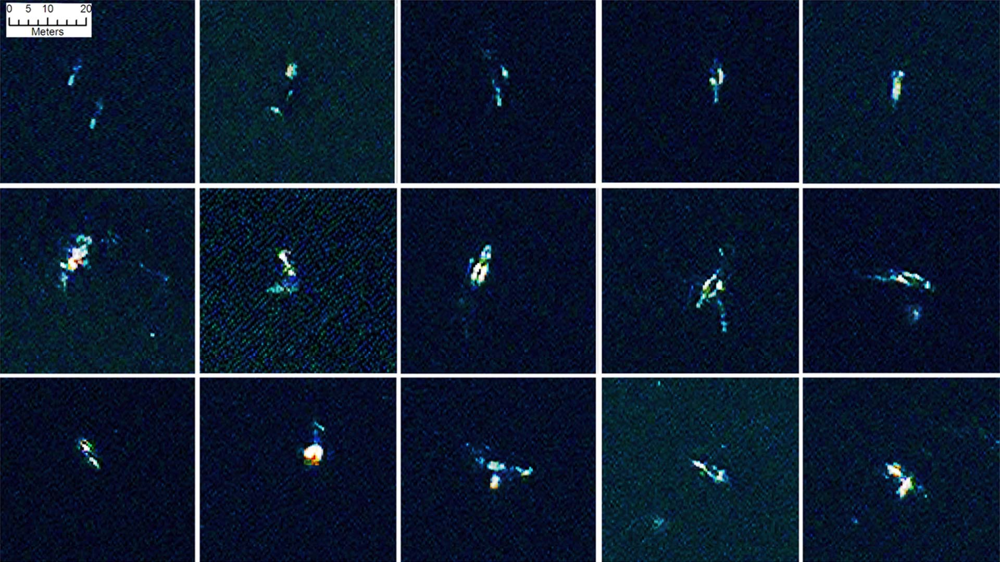

### Overview

**We present *Terrapattern*: “similar-image search” for satellite photos.** It's an open-source tool for discovering “patterns of interest” in unlabeled satellite imagery—a prototype for exploring the unmapped, and the unmappable. 

Terrapattern has an open-ended interface for visual query-by-example. Just click an interesting spot on Terrapattern's map, and it will find other locations that look similar. Our tool is ideal for locating specialized nonbuilding structures and other forms of soft infrastructure that aren't usually indicated on maps.

There has never been a more exciting time to observe human activity and understand the patterns of humanity’s impact on the world. We aim to help people discover such patterns in satellite imagery, with the help of deep learning machine vision techniques. 

---
### Gallery

...?

---
### Motivation and Intended Use

It has been predicted that, within the next three years, access to daily-updated, whole-earth satellite imagery with sub-meter resolution will become widely available online. There will be many important stories about natural and human activities latent in this data. Without special effort, however, it is doubtful that this imagery will have annotation layers that make such stories discoverable.

In light of this, the *Terrapattern* prototype is intended to demonstrate a workflow by which users—such as journalists, citizen scientists, humanitarian agencies, social justice activists, archaeologists, urban planners, and other researchers—can easily search for visually consistent “patterns of interest”. We are particularly keen to help people identify, characterize and track indicators which have not been detected or measured previously, and which have sociological, humanitarian, scientific, or cultural significance. 

Our goal is to provide a geospatial software tool that makes it easy for everyday people, who may lack expertise in machine vision, to specify the *thing* that they are interested in; to automatically find more examples of that *thing*; and to provide the locations of those instances in a common data format that easily allows for further examination. 

---
### About our Prototype

*Terrapattern* is a “panoptic perceptron” that allows a user to perform *queries-by-example* in satellite imagery. A visitor clicks on a “feature of interest” in a satellite image; the *Terrapattern* system returns a batch of the most similar-looking places nearby; and the visitor can then download a list of these locations in GeoJSON format.

For our purposes, “interesting” features are anthropogenic or natural phenomena that are not only socially or scientifically meaningful, but also *visually distinctive*—thus lending themselves ideally to machine recognition. Examples could include things like animal herds, methane blowholes, factories, destroyed homes, or logging roads. Many other patterns await discovery.

We aim to test the assumptions: 

* That there are *undiscovered patterns of activity* that are only visible from the vantage point of satellite imagery; 
* That these patterns can *offer insight* into trends, stories and phenomena of social, economic, ecological, anthropological, humanitarian, scientific, artistic or other cultural interest;
* That there exists a subset of such patterns in satellite imagery which, because of their repetition and visual consistency, lend themselves particularly well to automated detection and analysis by means of computer vision and machine learning; 
* That there is (or would be) demand for information about these patterns among domain experts, as well as among journalists, citizen scientists, and others in the Fourth Estate;
* And that it is possible to create software tools which make such workflows easy and reliable, for researchers whose teams might otherwise lack expertise in computer vision and machine learning. 

We emphasize that *Terrapattern* is a limited **prototype**. As of May 2016, it allows users to search in the greater metropolitan regions of three American cities: New York City, San Francisco, and Pittsburgh (Allegheny County). Altogether more than 2,200 square miles (5700 km²) are fully searchable. Allowing high-resolution searches in an area the size of the United States (e.g. ~3.8M mi² or 9.9M km²) is technically and financially beyond the scope of our project at the current time. 

---
### Inspirations

[//]: # (See slideshow code at http://www.w3schools.com/howto/howto_js_slideshow.asp)

Democratization. 

Once the exclusive domain of top-secret military surveillance, high-resolution satellite imagery has quickly become heavily corporatized. There is enormous money to be made. At the forefront of this are companies like [Orbital Insight](https://orbitalinsight.com/), [Remote Sensing Metrics](https://www.rsmetrics.com/) and [Genscape](http://www.genscape.com/), which apply machine learning algorithms to satellite imagery in order to sell "actionable intelligence" to hedge funds and other market speculators. For example, in their "[US Retail Traffic Index](https://orbitalinsight.com/solutions/us-retail-traffic-indices/)", RS Metrics monitors the number of cars in retail parking lots, in order to estimate the quarterly performance of big-box stores before those results have been released. Likewise, Orbital Insight's "[World Oil Storage Index](https://orbitalinsight.com/solutions/world-oil-storage-index/)" produces daily estimates of the amount of oil held in 20,000 storage tanks—by measuring the size of shadows on the interiors of tanks with floating lids. 

"Orbital Insight for the Rest of Humanity"

Environmental: 

Humanitarian, DataKind roof

Tracking animal populations & megafauna

For science 

For art

Onformative
Benedikt Gross

Previously, work of this kind has been highly bespoke, customized in idiosyncratic ways for specific problems by isolated teams.

first spotted by a helicopter pilot in 2013.
In an ominous positive feedback loop, a recently discovered crater in the thawing Siberian permafrost is spewing methane, a potent greenhouse gas, into the atmosphere. Photo by Marya Zulinova, press service of the Governor, Yamal-Nenets Autonomous District (YaNAO).

* Catching pirate fishers

* new logging roads in the central Peruvian Amazon

Speculative: Concentrated Animal Feeding Operations, or CAFOs; URANIUM MILL TAILINGS DEPOSITS Uranium mill tailings deposits

* "Gamma Gardens", also called radiation farms, are tomic Gardening/ Radiation Farms)
http://pruned.blogspot.com/2011/04/atomic-gardens.html mutation breeding

The Signal Program worked with 2014 HHI
fellow Michael Hughes last year to develop
a prototype feature extraction algorithm,
called “Tukul Detector”. The Tukul DetecSIGNAL
PROGRAM
ON HUMAN SECURITY AND
TECHNOLOGY
tor identifies and counts traditional African
huts, known as “tukuls”, that are routinely
present in satellite imagery of rural regions
in Africa. 

 Whether these patterns concern elephants, parking lots, logging roads, oil tanks, swimming pools, construction sites, munitions craters, methane blowholes, or other phenomena, we cannot predict: it is only important that the patterns of interest are visually consistent enough for algorithmic detection and analysis.

---
### Credits

We're a group of new-media artists, creative technologists, and students who are affiliated in various ways with the Frank-Ratchye [STUDIO for Creative Inquiry](studioforcreativeinquiry.org) at Carnegie Mellon University, a lab for experimental research at the intersection of art, science, technology and culture. This project was made possible by a grant in Media Innovation from the [John S. and James L. Knight Foundation](http://knightfoundation.org/grants/201551228/) [Prototype Fund](http://www.knightfoundation.org/funding-initiatives/knight-prototype-fund/). For more information, please see our [**team**](/team) page. 

