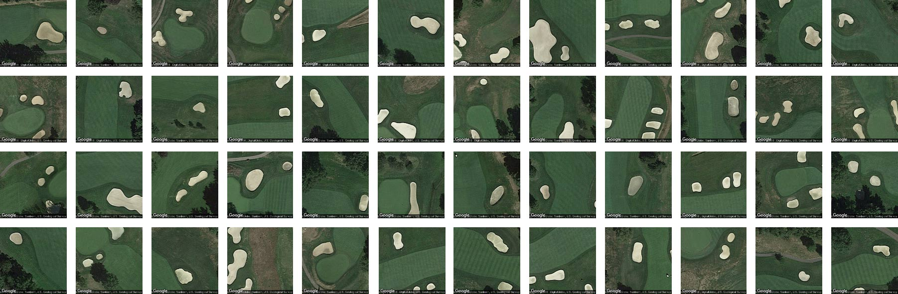
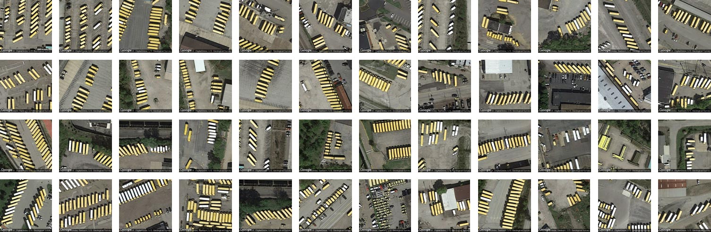
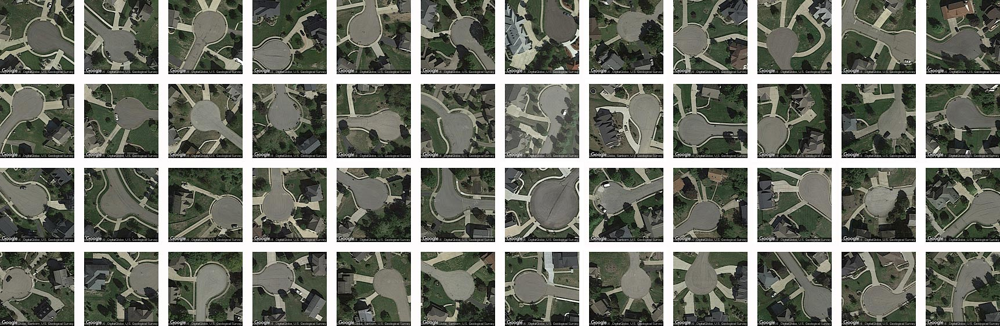

### Examples

Many features 'nonbuilding structures' and other forms of soft infrastructure that aren't already labeled.

typologies, ephemeral

Here, for example, are [golf course sand traps](http://pgh.terrapattern.com/?lat=40.5261395&lng=-79.8810095) identified by our system in the Pittsburgh metro region:  

Here, Terrapattern identified some of Pittsburgh's finest [school bus depots](http://pgh.terrapattern.com/?lat=40.461872&lng=-79.77872100000002):

...a collection of our city's suburban [cul-de-sacs](http://pgh.terrapattern.com/?lat=40.495312&lng=-80.16384749999997): 

Or [boat docks](http://pgh.terrapattern.com/?lat=40.4310445&lng=-79.96682199999998), found along Pittsburgh's rivers:

Here are some more example searches you can try: [baseball diamonds](http://pgh.terrapattern.com/?lat=40.355282&lng=-80.14462550000002) • [semi-trailer trucks on highways](http://pgh.terrapattern.com/?lat=40.4582145&lng=-80.1116735) • [USAF bombers](http://pgh.terrapattern.com/?lat=40.4926995&lng=-80.21327550000001) • [cracked tarmac](http://pgh.terrapattern.com/?lat=40.499492&lng=-80.23593) • [bridges](http://pgh.terrapattern.com/?lat=40.4874745&lng=-79.905037) • [fracking wells](http://pgh.terrapattern.com/?lat=40.292582&lng=-79.94142149999999) • 
[swimming pools in the woods](http://pgh.terrapattern.com/?lat=40.5721195&lng=-79.94004849999999) • [Christmas tree farms](http://pgh.terrapattern.com/?lat=40.656242&lng=-79.75606649999997) • [tennis courts](http://pgh.terrapattern.com/?lat=40.468142&lng=-80.13158199999998) • [football stadium logos](http://pgh.terrapattern.com/?lat=40.443062&lng=-79.94004849999999) • [transformer stations](http://pgh.terrapattern.com/?lat=40.465007&lng=-80.0471425) ...

Boaty mcBoatBoats
http://nyc.terrapattern.com/?lat=40.7020918&lng=-74.02688639999997
http://nyc.terrapattern.com/?lat=40.6973893&lng=-74.0330649

NYCHA Public Housing 
http://nyc.terrapattern.com/?lat=40.6958218&lng=-73.97951790000002
http://nyc.terrapattern.com/?lat=40.7308293&lng=-73.97539890000002

Roof Fan
http://nyc.terrapattern.com/?lat=40.7412793&lng=-73.97333939999999

Rail Yards
http://nyc.terrapattern.com/?lat=40.7548643&lng=-74.00423189999998

And whatever this is
http://sf.terrapattern.com/?lat=37.4902277&lng=-122.16311100000001

http://sf.terrapattern.com/?lat=37.5597202&lng=-122.01620000000003
http://sf.terrapattern.com/?lat=37.6051777&lng=-122.03679499999998
http://sf.terrapattern.com/?lat=37.7843952&lng=-122.47272250000003
http://sf.terrapattern.com/?lat=37.8585902&lng=-122.49331749999999 

http://sf.terrapattern.com/?lat=37.7849177&lng=-122.46448450000003 
http://sf.terrapattern.com/?lat=37.5038127&lng=-122.04846550000002
http://sf.terrapattern.com/?lat=37.7791702&lng=-122.45761950000002 
http://nyc.terrapattern.com/?lat=40.7721068&lng=-73.8614399
http://nyc.terrapattern.com/?lat=40.6686518&lng=-74.16899189999998
http://nyc.terrapattern.com/?lat=40.8332393&lng=-74.14015890000002

