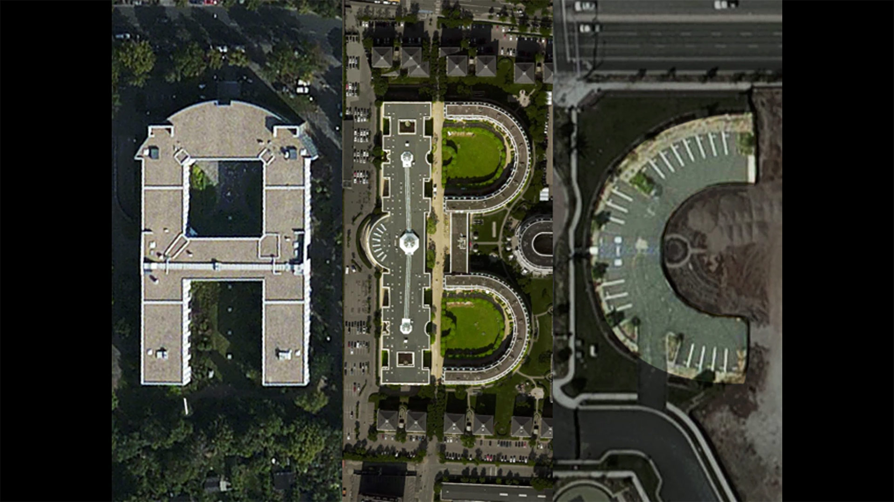

### Inspirations

The Terrapattern project seeks to democratize geospatial intelligence. By providing a means by which researchers, journalists, citizen scientists, and artists can quickly and easily scan extremely large geographical areas for specific visual features, our hope is that the public at large will gain the ability to research and answer questions about our world that are otherwise unknowable. 

Access to satellite imagery, especially as it can be interpreted through the lens of machine intelligence, is currently controlled by a select few: state-level actors and (increasingly) multinational businesses. Once the exclusive domain of top-secret military surveillance, high-resolution satellite imagery has recently become heavily corporatized. At the forefront of this shift are companies like [Orbital Insight](https://orbitalinsight.com/), [Remote Sensing Metrics](https://www.rsmetrics.com/) and [Genscape](http://www.genscape.com/), which apply machine learning algorithms to satellite imagery in order to sell "actionable intelligence" to hedge funds and other market speculators. For example, in their "[US Retail Traffic Index](https://orbitalinsight.com/solutions/us-retail-traffic-indices/)", RS Metrics monitors the number of cars in retail parking lots, in order to estimate the quarterly performance of big-box stores before those results have been released. Similarly, Orbital Insight's "[World Oil Storage Index](https://orbitalinsight.com/solutions/world-oil-storage-index/)" consists of daily estimates of the amount of oil held in 20,000 storage tanks&mdash;intelligence derived from the size of shadows on the interiors of tanks with floating lids. With enormous amounts of money to be made in the trade of such information products, this type of understanding about the forces shaping our world remains very far from being a public good.

We wondered what it would be like to provide an **"Orbital Insight for the rest of humanity"**: a tool that could help those who are concerned about or interested in the world&mdash;whether through environmental studies, journalism, humanitarian efforts, social sciences, natural sciences, or artistic inquiry&mdash;obtain geospatial understanding of the kind only previously available to a select few. In this section, we highlight a few projects by others which we consider powerfully inspirational illustrations of this: the democratization of machine intelligence for satellite imagery.

At the forefront of environmental efforts is the non-profit organization, [Monitoring of the Andean Amazon Project](http://maaproject.org/en/) (MAAP), which uses satellite imagery and computer vision to analyze the Amazonian rainforest. In some of their best-known work, supported through the [Planet Labs Ambassadors Program](https://www.planet.com/impact/), MAAP has successfully detected [illegal gold mines](http://maaproject.org/2016/invasion-tambopata-3/), as well as [illegal logging roads](http://maaproject.org/2015/maap18-logroads/), which are key precursors to deforestation. Other environmental initiatives have used related techniques to, for example, bust [illegal fishing operations](http://news.nationalgeographic.com/2015/06/150615-skytruth-pirate-fishing-illegal-big-data-ocean-conservation/).

At the Harvard Humanitarian Initative's "Signal Program on Human Security and Technology", a series of influential projects directed by [Nathaniel Raymond](https://en.wikipedia.org/wiki/Nathaniel_Raymond) has used satellite imaging to investigate war crimes, genocides, and other atrocities. Raymond is among the most outspoken advocates for the use of geospatial intelligence by human rights groups and other non-governmental organizations (NGOs). In one project, Raymond and his team used machine learning techniques to [automatically identify Sudanese straw-hut dwellings](http://hhi.harvard.edu/sites/default/files/publications/siig_ii_burned_tukuls_3.pdf), known as *tukuls*, in satellite imagery. Their team's tukul-detector was able to successfully distinguish intact tukuls from ones which had been razed&mdash;an excellent proxy for detecting mass killings, in a part of the world where on-the-ground journalism is exceptionally risky.

In [another humanitarian project](http://krvarshney.github.io/pubs/AbelsonVS_kdd2014.pdf), data scientists from DataKind.org collaborated with members of GiveDirectly, an NGO which gives microgrants to impoverished people in developing nations. In order to know where to focus their efforts, the team developed software to analyze the ratio of straw roofs to metal roofs in each of the districts of a Central African country. This ratio proved to be a good proxy for estimating the relative wealth of each of the districts, for a country otherwise lacking in census data of this sort. 

The combination of satellite imaging and machine vision has also had a major impact on our ability to track animal populations. For example, one team of scientists were able to track Antarctic penguin populations&mdash;and take measurements of their diets&mdash;by [observing their poo from space](http://www.bbc.com/earth/story/20141210-surprising-use-of-penguin-poo). Another team of scientists was able to [locate and count families of Southern Right Whales](http://journals.plos.org/plosone/article?id=10.1371/journal.pone.0088655). 

The telescopic perspective of satellite imagery has enormous potential to provide *scientific* insights that could not be obtained otherwise.  For example, "space archaeologist" [Dr. Sarah Parcak](http://www.wired.co.uk/magazine/archive/2014/12/start/scanning-the-past), a professor at the University of Alabama at Birmingham, has used remote sensing technologies, image processing and computer vision in order to discover ancient Egyptian pyramids and even a previously unknown site of Viking activity in North America. In another fascinating discovery, Dr. Sabine Begall, a professor of Zoology at the University of Duisburg-Essen, has discovered that ruminants have a previously undiscovered geomagnetic sense&mdash;essentially, that [grazing cows align themselves with the earth's magnetic field](http://www.pnas.org/content/early/2008/08/22/0803650105). 

The arts have the power to provide insights of an altogether different sort.  A number of artists have employed various forms of human and/or machine intelligence to the domain of satellite imagery, in order to produce projects that inform, provoke, entertain, and delight. An excellent example of this is the project "[*Aerial Bold*](http://type.aerial-bold.com/tw/)" by Benedikt Gro&#223; and Joseph Lee, which is a typeface wholly constructed from letterforms found in satellite imagery. Whereas Gro&#223; and Lee use a mixture of crowdsourcing and automated detection, artist Jenny Odell uses a more personalized, curatorial approach in her [*Satellite Collections*](http://www.jennyodell.com/satellite.html) project (2009-2011), in which parking lots, silos, landfills, waste ponds are compiled into typological collages. Of her work, Odell writes that "*The view from a satellite is not a human one, nor is it one we were ever really meant to see. But it is precisely from this inhuman point of view that we are able to read our own humanity, in all of its tiny, repetitive marks upon the face of the earth. From this view, the lines that make up basketball courts and the scattered blue rectangles of swimming pools become like hieroglyphs that say: people were here.*"

Other interesting artworks in this space include [*The Big Atlas of LA Pools*](http://benedikt-gross.de/log/2013/06/the-big-atlas-of-la-pools/) (also by Gro&#223; & Lee), and Joshua Begley's stunning [*Prison Map*](http://prisonmap.com).

In many of the examples discussed above, researchers developed bespoke visual detectors that were tightly tuned and customized for specific problems. The techniques used in Terrapattern portend a new form of highly generalized detector which can be used in searches by relative laypersons. In this new workflow, it is only important that the patterns of interest are visually consistent enough for algorithmic detection and analysis.

There are a number of burgeoning, visually consistent, and in many cases worrisome phenomena which future versions of Terrapattern could be useful in tracking. These include [Concentrated Animal Feeding Operations](http://www.wired.com/2013/09/mishka-henner-factory-farms/), or CAFOs; [uranium mill tailings deposits](http://clui.org/ludb/site/ambrosia-lake-uranium-tailings-pile); "[Gamma Gardens](http://pruned.blogspot.com/2011/04/atomic-gardens.html)" (also called radiation farms) for mutation breeding; [Siberian methane blowholes](http://news.nationalgeographic.com/news/2015/02/150227-siberia-mystery-holes-craters-pingos-methane-hydrates-science/), which are arising due to global warming; and [megafauna poaching](http://news.nationalgeographic.com/news/2014/08/140818-elephants-africa-poaching-cites-census/). The Terrapattern project is only a prototype&mdash;especially in its scale&mdash;and we feel we have only scratched the surface of what is possible. 