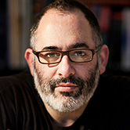

### Golan Levin

Terrapattern project director, [**Golan Levin**](http://flong.com/) ([@golan](https://twitter.com/golan)) is Associate Professor of Computation Arts at Carnegie Mellon University, where he also holds courtesy appointments in Computer Science, Entertainment Technology, Architecture, and Design. Since 2009 he has served as Director of the [Frank-Ratchye STUDIO for Creative Inquiry](http://studioforcreativeinquiry.org), a laboratory for atypical and anti-disciplinary research across the arts, science, technology and culture. A two-time TED speaker and recipient of undergraduate and graduate degrees from the MIT Media Laboratory, Golan was recently named one of "50 Designers Shaping the Future" by Fast Company. Through digital artifacts, online tools, and virtual environments, often created with a variety of collaborators, Levin applies creative twists to digital technologies that highlight our relationship with machines, reveal hidden aspects of communication, and new intersections of machine code and visual culture.