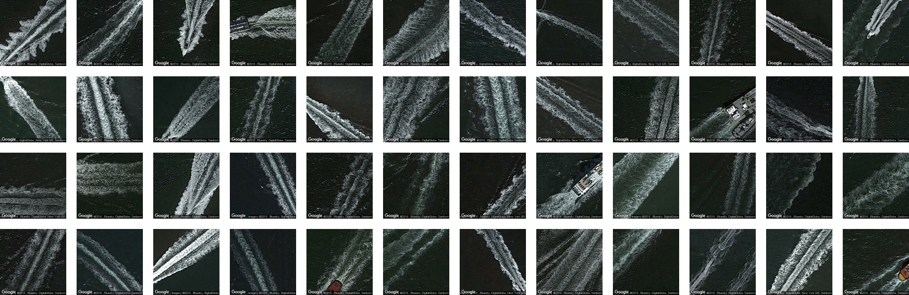

**Terrapattern can identify things like:** 

...[**boat wakes**](http://nyc.terrapattern.com/?lat=40.7532968&lng=-74.01452940000001) in New York City rivers,

...[**shipping container yards**](http://nyc.terrapattern.com/?lat=40.7532968&lng=-74.01452940000001) in Manhattan,

...[**suburban cul-de-sacs**](http://pgh.terrapattern.com/?lat=40.495312&lng=-80.16384749999997) near Pittsburgh,

*...and much more!*
